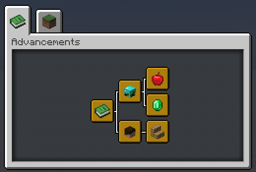

# Datapack Advancement (`*`)

## About

This convention aims to generalize the installation message into an easily viewable and non-obstructive way by putting it on a single advancement page.

## Preview

This is an example of what this convention will look like



## Implementation

The guideline is made up of 3 advancement nodes: `Root`, `Namespace` and `Datapack`

## 1. Root Advancement

This advancement is the root of all installed datapack's advancements.


You **must** create this file at `/data/global/advancements/root.json`.

```json
{
    "display": {
        "title": "Installed Datapacks",
        "description": "",
        "icon": {
            "item": "minecraft:knowledge_book"
        },
        "background": "minecraft:textures/block/gray_concrete.png",
        "show_toast": false,
        "announce_to_chat": false
    },
    "criteria": {
        "trigger": {
            "trigger": "minecraft:tick"
        }
    }
}
```

## 2. Namespace Advancement

This advancement indicates the creator of the datapack.


It **must** be in the same location in every datapacks of yours. I recommend that you put it inside `/data/global/advancements/<namespace>.json`.

```json
{
    "display": {
        "title": "<Your name>",
        "description": "",
        "icon": {
            "item": "minecraft:player_head",
            "nbt": "{SkullOwner: '<your_minecraft_name>'}"
        },
        "show_toast": false,
        "announce_to_chat": false
    },
    "parent": "global:root",
    "criteria": {
        "trigger": {
            "trigger": "minecraft:tick"
        }
    }
}
```

> **Note**  
> If you are working on a project with multiple people you can choose to:
> - Display this advancement as your own and credit them with other methods.
> - Display this advancement with the "team name" of your choice.
> - Display a "[Standalone Datapack](#extra-standalone-datapack)" instead.

## 3. Datapack Advancement

This advancement is used to display installation information about your datapack. It should be unique among your other datapacks.


You can create this advancement anywhere as long as you **don't** pollute `/data/global/advancements/folder`

```json
{
    "display": {
        "title": "<datapack name>",
        "description": "<datapack description>",
        "icon": {
            "item": "<item>"
        },
        "announce_to_chat": false,
        "show_toast": false
    },
    "parent": "global:<namespace>",
    "criteria": {
        "trigger": {
            "trigger": "minecraft:tick"
        }
    }
}
```

## Note

The syntax `<...>` indicates that you have to replace it with something else!

## Extra: Standalone Datapack

This is an optional syntax that you can take to display installed datapack *without* displaying the creator's information.

To implement this you simply skip the [#2: Namespace Advancement](#2-namespace-advancement) step and make sure that in step [#3: Datapack Advancement](#3-datapack-advancement) you create your file inside `/data/global/advancements/standalone/` directory.

> Keep in mind that if you are planning to release more datapacks under this name. You should use the normal syntax over this one.
