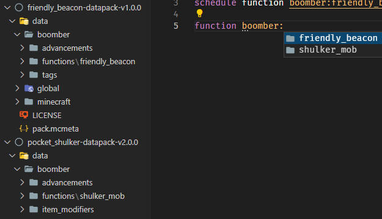

# Namespace Convention (`***`)

## About

This convention aims to prevent conflict when deciding the name for your scoreboards, functions, storages, etc. by using a "namespace prefix".

## Implementation

A namespace prefix must be used whenever it is possible. This includes tags (datapack), tags (`/tag`), nbts, scoreboards, teams, functions, advancements, loot tables, structures, world generation settings, recipes, data storage.

There is no rule specifying how you should design your namespace prefix, but these are some of the examples:

-------------------

```mcfunction
scoreboard objectives add bb.var dummy
team add bb.team
```

In this example `bb` is the namespace which is shortened from `boomber` due to 16 characters limitation. I like to keep scoreboard and team namespace short and use `.` to seperate the namespace from the name. If lower than v.1.18

```mcfunction
scoreboard objectives add boomber.var dummy
team add boomber.team
```

I use the entire `boomber` prefix in this example because scoreboards and teams in 1.18 don't have a character limit.

-------------------

```mcfunction
tag @s add boomber.foo.bar
```

In this example, I use a full `boomber` prefix, because tags don't have a character limit.

--------------------

```mcfunction
data merge storage boomber:foo/bar {}
```

In this example data storage already has support for namespacing, so I don't need to use a prefix.

--------------------

```mcfunction
give @s diamond{boomber: {custom_data: 123}}
```

In this example, I wrap the `custom_data` nbt inside another tag, allowing it to act as a namespace.

--------------------

The above examples are my style of namespacing, but there are many other approaches that you can take, such as `namespace_foo`, `NAMESPACEfoo`, `namespace.foo`, `namespace:foo` and `namespace/foo`. Your imagination is the limit!

## Note

Using `minecraft` namespace to modify vanilla's behavior is a special case and it is allowed within a reasonable situation.  
However, for example, setting `"replace"` to `true` in the `tick.json` function tag is not a "reasonable situation", because that would prevent other datapacks from working.

--------------------

### **Note from Convention Mod (Optional)**

There are a few issues with using namespaces regarding the datapack file structure and follow [Datapack Advancement](./datapack_advancement.md), this is my recommended technique.

> **Multiple packs**
> - **Issue:** Some packs use the `datapack_name` as their namespace.
> - **Sub Issue:** Datapack node **must not** be in `/data/global/advancements/folder`. 
Causing the need to take this file to `/data/<namespace>/advancements/`
It became like this `/data/<datapack_name>/advancements/<datapack_name>.json`
> - **Solution:** Fact it's creator name.
> - **Because:** If creator plan to release more datapacks, it will be very helpful when you work on workspace.
> - **Result:** `<creator_name>:<datapack_name>` When there are multiple packs, the name on front is to identify who created it and next it to tell what datapack it is. This will be explained further in 
[Directories guideline](#directories-guideline)
```
data
 ├ <namespace> <- It doesn't make sense to set it as datapack_name.
 │    ╰ advancements         
 │        ╰ <datapack_name>.json
 ├ <global>
 │    ╰ advancements
 │        ├ <namespace>.json <- "This is creator_head" * That's why
 │        ╰ root.json
```


> **Standalone pack**
> - That means you have everything in 1 datapack only.
> - **Fact:** Completely free with namespaces.
> - **Because:** There is no more than 1 pack in your project.
> - **Result:** `<datapack_name>:<every_internal_function>` When there is 1 pack, which you may name it with, the `creator_name` and `datapack_name` mix or whatever. And everything under that name does not need to be identified. `<datapack_name>`, which makes you know exactly what this pack is, what functionality it comes from and who made it.
```
data
 ├ <namespace> <- It make sense to set it as datapack_name.
 │    ╰ <...>
 ├ <global>
 │    ╰ advancements
 │        ├ standalone 
 │        │    ╰ <datapack_node>.json <- "This is datapack node" * That's why completely free.
 │        ╰ root.json
```
### Directories guideline
> **Guideline Optional**
> - **Standalone pack:** Completely free, as long as you need to do.
> - **Multiple packs:** If possible, I would recommend the following.
> - **FAQ**: If I use `creator_name` instead of `datapack_name`. I'm going to have a problem like this
```
Before pack1 "friendly_beacon:main" -> After pack1 "boomber:main"
Before pack2 "shulker_mob:main" -> After pack2 "boomber:main",
```
> Seriously? you don't know it can do this.
> - `boomber/functions/friendly_beacon/`
> - `boomber/functions/shulker_mob/`

```
Before pack1 "friendly_beacon:main" -> After pack1 "boomber:friendly_beacon/main"
Before pack2 "shulker_mob:main" -> After pack2 "boomber:shulker_mob/main",
```
If you need a sample, I have it. 
```
data
 ├ <your_name>
 │    ├ advancements
 │    │   ├ <datapack_name>
 │    │   │   ├ <event>
 │    │   │   │   ╰ <player_hurt_entity>.json
 │    │   │   ├ <place>
 │    │   │   │   ╰ <place_block>.json
 │    │   │   ╰ <folder advancement groups>
 │    │   ╰ <datapack_name>.json
 │    ├ functions
 │    │   ├ <datapack_name>
 │    │   │   ├ <folder function groups>
 │    │   │   ├ main.mcfunction or tick.mcfunction
 │    │   │   ├ setup.mcfunction or init.mcfunction
 │    │   │   ╰ uninstall.function
 │    │   ╰ <database, random & etc.>
 │    ├ loot_tables
 │    │   ╰ <datapack_name>
 │    │       ╰ <loot folder groups item, block>
 │    │           ╰ <...>.json
 │    ├ predicates
 │    │   ╰ <datapack_name>
 │    │       ├ <folder predicate groups>
 │    │       ╰ <...>.json
 │    ├ recipes
 │    │   ╰ <datapack_name>
 │    │       ╰ <...>.json
 │    ╰ tags
 │        ╰  <items>
 │            ╰ <datapack_name>
 │                ╰ <...>.json
 ├ <global>
 │    ╰ advancements
 │        ├ <your_name>.json
 │        ╰ root.json
 ╰ <minecraft>
 ```

> **Scoreboard and team lower than v.1.18**
> - **Issue:** Some packs use the `datapack_name` as their shortened namespace.
> - **Sub Issue:** Suppose the pack `Bounce block` uses objective as `bb.var`.
Do you see the problem?
**What If** `bb` is the namespace which is shortened from `boomber`.
That's the problem.
> - **Advice**: Use namespace shortened from *your name* or *alias*.
> - **Fact:** Namespace conflicts can arise. But you can avoid it as much as possible.
> - **Because:** Static namespaces that are easier to control. Making it possible to eliminate the above problems.
> - **Result:** In all possibilities, It might give you a limit to tell what the objective is doing. But if managed well, you will be able to use a common objective for many tasks, not including the long-named fake_player scoreboard. If your name the objective well, `fake_player` will help you here.
> - **Did you know**: `fake_player` doesn't need to use namespace because it is already inside the objective namespace. `#`~~`bb`~~`.foo.bar bb.data`
**Or** if you want it to be clear and organized. You can use full name because `fake_player` don't have a character limit. `#boomber.variable_θ bb.data`

> **Tags**
> - **Advice**: If possible, include a full name. `tag @s add boomber.foo.bar`
> - **Because:** It reduces the chance of conflicts from the length of clear name.

> **Storage**
> If let me advice, I hope this section will be useful to uninstall.
> - **Advice**: `boomber:<datapack_name> bb.<path_storage_name>` 
> - **Because:** If you are using a namespace, you can remove storage with a single command. Ex.: `data remove storage boomber:<datapack_name> bb`.
> - **What if:** If it's a `standalone pack`, an ex. from The Creeper's Code pack is interesting.
`tcc:storage root.<path_storage>`

 **Other cases are acceptable**
 - Will continue to review versions lower than 1.18, but will not guarantee if any scoreboard conflicts occur.
 - `scoreboard trigger` unnecessary use a namespace.
Since it will be exposed to the user, so a nice readable name is quite important. We should allow it for now considering the benefit of readable trigger name.
 - You can use `datapack_name` at `namespace`, no problem. It depends on the writing style of each datapacker. But there may be some minor issues in the future. Therefore, please be forewarned. To suggest that you change it when you can, before can't be changed in the future. (I found this case of Datapack Utils by ICY105, since it acts as a core datapack, namespace changes will cause datapacks using these cores to be affected as well.) Hopefully, these tips will help you develop good coding. 
> **6 Features of Good Software Code**
> - **Readable** : Would it be better if other developers Read the directory and understand who wrote this data pack from here. 
> - **Comment** : It would be better if there was
> - **Uncomplicated** : -
> - **High flexible** : It is very likely that there will be some part of the command that will need to be altered, refactor, or reused. If other datapacks use your datapack as well, such as core datapack, it will not immediately know who wrote it. 
> - **Easy maintenance** : That being said, it's useful for workspaces and grouping directories into classes. And it's useful for locating a directory.
> - **It works exactly as required** : -
>
In the features **High flexible & Easy maintenance** In dev datapack circles, there are identical datapacks written by different devs (but not copied at all), with the same functionality. (with different command's algorithm written in different dev methods, but with the same result) and may be slightly different, according to the functionality and design features. 
> Example cool stuff datapack here
> - [Veinminer by Boomber](https://www.planetminecraft.com/data-pack/veinminer-by-boomber/)
> - [VeinMiner by Gnottero](https://www.planetminecraft.com/data-pack/javd-just-another-veinminer-datapack/)
> - [Vein Miner Unified by Elemend](https://github.com/Elemend/Vein-Miner-Unified)

What is the problem if you use `datapack_name` at `namespace`? Chances are, but very few. But it doesn't mean there isn't. For example, the veinminer datapack, if you set the namespace to vm and other devs use it as well, it's an issue.
and does not explicitly identify under the developer's name. Because they are not grouped or classes directly under your name.
```
data veinminer:main
 ├ veinminer
 ├ <global>
 │    ╰ advancements
 │        ├ convention.json

data - villager_magic:main
 ├ villager_magic
 ├ <global>
 │    ╰ advancements
 │        ├ convention.json

data - veinminer_faq:tick
 ├ veinminer_faq
 ├ <global>
 │    ╰ advancements
 │        ├ faq.json

data - vm:tick
 ├ vm (Virtual Magic)
 ├ <global>
 │    ╰ advancements
 │        ├ faq.json
```
In view of the convention mod, it lacks flexibility and easy maintenance.

 But it's not wrong if you to use `datapack_name` at `namespace`.
```
data - convention:veinminer/main
 ├ convention
 │    ╰ functions
 │        ╰ veinminer
 ├ <global>
 │    ╰ advancements
 │        ├ convention.json

data - convention:villager_magic/main
 ├ convention
 │    ╰ functions
 │        ╰ villager_magic
 ├ <global>
 │    ╰ advancements
 │        ├ convention.json

 data - faq:veinminer/tick
 ├ faq
 │    ╰ functions
 │        ╰ veinminer
 ├ <global>
 │    ╰ advancements
 │        ├ faq.json

data - faq:virtual_magic/tick
 ├ faq
 │    ╰ functions
 │        ╰ virtual_magic
 ├ <global>
 │    ╰ advancements
 │        ├ faq.json

 ```
