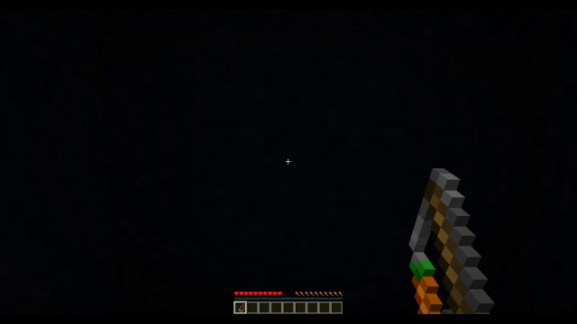

# Holding Right Click Detection

## About

This method allow you to detect when player is "holding" right click using carrot on a stick.

> Note: I will be referring to "carrot on a stick" as "coas" from now on

## Result

> A simple spell casting system where a spell will be casted when player hold right click for a period of time



## Concept

To detect when player is holding right click you need to know when player right click `coas` *twice* within a time threshold.  
Because Minecraft takes in `coas` input every 4 tick, a right click is considered continuous if it's performed within 5 ticks of another click.

## Implementation

1\. Setup scoreboard objectives

```
#[setup]

#> This objective is used for detecting when player is right clicking.
scoreboard objectives add <coas> minecraft.used:minecraft.carrot_on_a_stick

#> This objective is always more than 0 when player is holding right click
#> We can use this to detect when player is holding right click
scoreboard objectives add <timer> dummy
```

2\. Detect right click

```
#[main]
execute if score @s <coas> matches 1.. run function [coas/reset_timer]
```

3\. Detect holding right click

```
#[main]

# Decrease <timer> by one until it hits 0
scoreboard players remove @s[scores={<timer>=1..}] <timer> 1

# If <timer> is more than 0, we know that the player have right clicked within the last 5 ticks.
# (Since <timer> decrease by 1 every tick and every time a right click is performed <timer> is set to 5 again.)
execute if score @s <timer> matches 1.. run say Player is Holding Right Click!
```

```
#[coas/reset_timer]

# Set <timer> to 5 and <coas> to 0
scoreboard players set @s <timer> 5
scoreboard players set @s <coas> 0
```

5\. Conclusion
If <timer> is more than 0, we know that the player have right clicked within the last 5 ticks since <timer> decrease by 1 every tick and every time a right click is performed <timer> is set to 5 again.  
We can use `execute if score @s <timer> matches 1..` to know if <timer> is more than or equal to 1.

## Note

- `<...>` is a placeholder value that you have to replace with your own value.
- `[...]` is a placeholder path to display relationship between each functions.

## Example Datapack

You can download the [example datapack](./holding_right_click_detection/example.zip) here.

This example pack contains extra code used to display the title message to player.  

Happy Datapacking!  
\- Cocoon